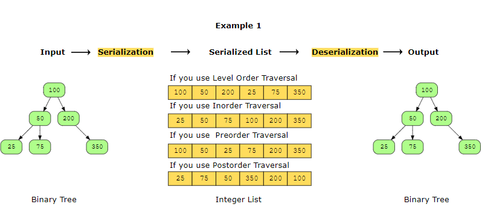
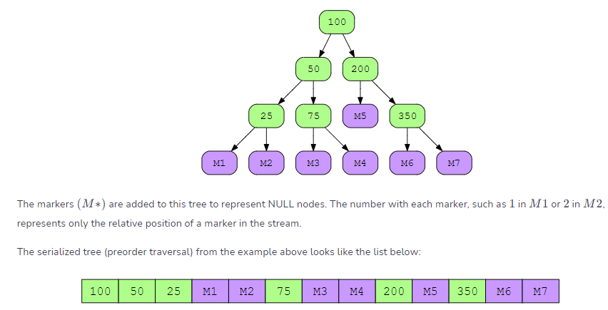
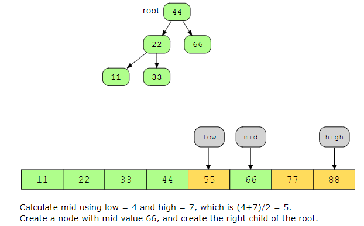

## flatten binart tree to linkedlist #############

## diameter of binary tree #######################
The diameter of a binary tree is the length of the longest path between any two nodes in a tree. This path may or may not pass through the root.

## serialize and Deserialize Binary Tree ###########
Serialize: Write the tree to a file.

Deserialize: Read from a file and reconstruct the tree in memory.

## Invert Binary Tree ############################

solution:
Perform post-order traversal on the left child of the root node.
Perform post-order traversal on the right child of the root node.
Swap the left and right children of the root node.

## Binary Tree Maximum Path Sum #################

## Convert Sorted Array to Binary Search Tree ######
Given an array of integers, nums, sorted in ascending order, your task is to construct a height-balanced binary search tree (BST) from this array.

In a height-balanced BST, the difference of heights of the left subtree and right subtree of any node is not more than 1.

