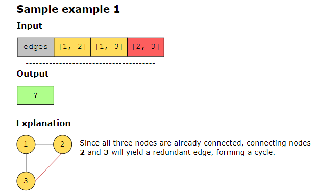
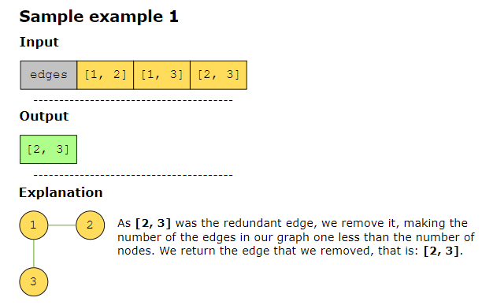
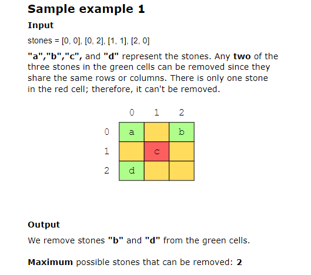

## Redundant Connection ######################
We’re given an undirected graph consisting of 𝑛 nodes. The graph is represented as list called edges, of length 𝑛, where edges[i] = [a, b] indicates that there is an edge between nodes a and b in the graph. Return an edge that can be removed to make the graph a tree of 𝑛 nodes. If there are multiple candidates for removal, return the edge that occurs last in edges.

## Number of Islands ########################
Let’s consider a scenario with an (𝑚×𝑛) 2D grid containing binary numbers, where '0' represents water and '1' represents land. If any '1' cells are connected to each other horizontally or vertically (not diagonally), they form an island. Your task is to return the total number of islands in the grid.

## Most Stones Removed with Same Row or Column ################
 The goal is to find the maximum number of stones that can be removed while ensuring that at least one stone remains in each connected component of stones.

Offset Explanation:

The offset ensures that the row indices and column indices do not overlap in the Union-Find structure. By adding a large constant (100,000) to the column index, we effectively create a unique namespace for columns distinct from the rows.
This allows us to treat each stone's row and column as unique elements in the Union-Find structure, ensuring proper union operations without index collisions.

Let's run through the example stones = [[0, 0], [0, 1], [1, 2], [2, 2], [3, 3]].
Union Operations: use the Union-Find data structure to connect stones in the same row or column into disjoint sets

Union (0, 0+100000) => Union (0, 100000)
Union (0, 1+100000) => Union (0, 100001)
Union (1, 2+100000) => Union (1, 100002)
Union (2, 2+100000) => Union (2, 100002)
Union (3, 3+100000) => Union (3, 100003)

Counting Groups:

After all union operations, the groups are:
Group 1: {0, 100000, 100001}
Group 2: {1, 2, 100002}
Group 3: {3, 100003}
Total unique groups: 3

Removable Stones Calculation:

Total stones = 5
Total groups = 3
Removable stones = 5 - 3 = 2

## Longest Consecutive Sequence #################
Given an unsorted array, nums, your task is to return the length of the longest consecutive sequence of elements. The consecutive sequence of elements is such that there are no missing elements in the sequence. The consecutive elements can be present anywhere in the input array.

