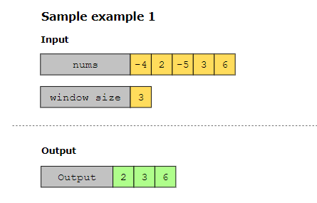

1- Initial Setup:

Data Structures Used:
A deque to maintain indices of the array elements. These indices are kept in a way such that the values they point to are always in descending order.
An output list to store the maximum values for each sliding window.
Process:
2- First Window Preparation:

Traverse through the first w elements of the array (where w is the window size).
For each element:
Remove elements from the back of the deque if they are less than the current element because they cannot be the maximum if a larger element exists more recently in the window.
Add the current element's index to the deque.
The largest element for the first window is at the front of the deque, and its value is stored in the output list.
3- Sliding the Window:

For the rest of the elements in the array:
Move the window one position to the right each time.
Before adding the new element (at the end of the new window) to the deque:
Remove elements from the back of the deque if they are less than the current element to maintain the descending order of values in the deque.
Remove the oldest element from the front of the deque if it is outside the bounds of the new window (i.e., if its index is less than the current window's start index).
Add the new element's index to the deque.
The front of the deque now points to the index of the maximum value for the current window, so record that value in the output list.
Key Operations:
Cleaning Up the Deque:
From the back: Ensure the elements are in descending order by value, so more recent elements that are larger force the removal of older, smaller elements.
From the front: Remove indices that are no longer within the window’s range as the window slides.

Solution 1: Using Deque (Double-Ended Queue)
Approach:

Maintains a deque (current_window) that stores indices of array elements. The indices are stored in such a way that the deque always contains indices in decreasing order of the values in nums.
Before adding a new index to the deque, it removes indices of all elements from the back of the deque which are less than or equal to the element at the current index (clean_up function). This ensures that the deque's front always has the index of the maximum element for the current sliding window.
It also removes indices from the front if they are out of the current sliding window's bounds.
Complexity:

Time Complexity: O(n), where n is the number of elements in nums. Each element is processed once when it is pushed to and popped from the deque.
Space Complexity: O(w), where w is the window size, because at most w indices might be stored in the deque.

Solution 2: Using Nested Loops and Max Function
Approach:

Iterates through each possible sliding window and uses Python’s built-in max() function to find the maximum in the current window slice nums[i:i+w].
Complexity:

Time Complexity: O(n*w), where n is the number of elements in nums and w is the size of the window. For each of the n-w+1 windows, the max() function iterates over w elements to find the maximum.
Space Complexity: O(n-w+1) for storing the result of max values for each window.